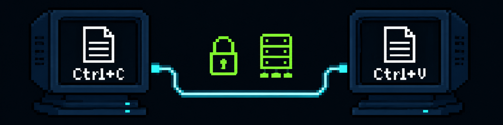

# ClipCopy

<p align="center">
  
</p>

<p align="center">
  <b>Shared clipboard for Linux.</b> Copy text on one machine, sync it through a secure relay, and use it on another.<br>
  Text-only, token-authenticated, TLS-capable, and designed to run quietly in the background.
</p>

<p align="center">
  
  
  
</p>

---

## Overview

ClipCopy is a Linux clipboard sync tool built around a simple model:

- the server stores the latest text clipboard payload
- clients detect local clipboard changes and send them to the server
- in `sync` mode, clients also receive remote updates and place them into the local clipboard
- traffic can be protected with TLS and a shared auth token

The current implementation is intentionally text-only. No image sync. No file sync.

## Architecture

```text
┌──────────────┐      wss://       ┌──────────────────┐      wss://       ┌──────────────┐
│  Client A    │ ────────────────→ │  Relay Server    │ ←─────────────── │  Client B    │
│  local copy  │                   │  stores latest   │                  │  local copy  │
│  clipboard   │                   │  and broadcasts  │                  │  clipboard   │
└──────────────┘                   └──────────────────┘                  └──────────────┘
```

- **Server** stores the latest clipboard payload and broadcasts updates to connected `sync` clients.
- **Client** watches the local clipboard and syncs text changes to the server.
- **Sync mode** keeps local clipboard text aligned with newer remote updates.
- **Loop prevention** avoids clients endlessly re-sending the same clipboard payload.

## Features

- text-only clipboard synchronization
- WebSocket relay server
- Linux client with `sync`, `watch`, and `paste` modes
- token-based authentication
- TLS support with automatic self-signed certificate generation on the server
- installer scripts for server and clients
- `systemd --user` service templates
- structured logs for troubleshooting

## Requirements

- Linux
- Python 3.10+
- `openssl`
- `wl-clipboard` on Wayland, or `xclip` / `xsel` on X11

Python dependencies are listed in [requirements.txt](requirements.txt).

## Quick Start

```bash
git clone https://github.com/amadeusGh/ClipCopy.git
cd ClipCopy
chmod +x scripts/*.sh
```

### Server

Install on the machine that will act as the relay:

```bash
./scripts/install_server.sh --public-host your-server.com
```

This will:

- create `.venv`
- install Python dependencies
- create `server_config.json`
- generate a random auth token if you do not pass one
- configure TLS certificate paths
- install and optionally start `clipcopy-server.service`

The installer prints the generated token. Use that same token on every client.

If you want to supply your own token:

```bash
./scripts/install_server.sh \
  --public-host your-server.com \
  --token "your-strong-token"
```

### Client

Install on each Linux desktop:

```bash
./scripts/install_client.sh \
  --server-host your-server.com \
  --token "your-strong-token"
```

This will:

- create `.venv`
- install Python dependencies
- fetch the server certificate automatically
- create `client_config.json`
- install and optionally start `clipcopy-client.service`

After installation, the client service runs in `sync` mode by default.

## Client Modes

`clipboard_watch.py` supports three modes:

| Mode | Behavior |
|---|---|
| `sync` | Send local clipboard updates to the server and apply newer remote updates locally. |
| `watch` | Send local clipboard updates to the server, but never apply remote updates. |
| `paste` | Fetch the latest server payload once and apply it only if the server copy is newer than the local copy. |

## Manual Usage

### Server

```bash
python3 clipboard_server.py --config server_config.json
```

### Client sync mode

```bash
python3 clipboard_watch.py --config client_config.json sync
```

### Client watch mode

```bash
python3 clipboard_watch.py --config client_config.json watch
```

### Client paste mode

```bash
python3 clipboard_watch.py --config client_config.json paste
```

### Client without a config file

```bash
python3 clipboard_watch.py \
  --server-host your-server.com \
  --server-port 8765 \
  --auth-token "your-strong-token" \
  --tls \
  --ca-cert .clipcopy_state/tls/clipcopy.crt \
  sync
```

For test-only environments:

```bash
python3 clipboard_watch.py \
  --server-host your-server.com \
  --server-port 8765 \
  --auth-token "your-strong-token" \
  --tls \
  --insecure-tls \
  sync
```

## Configuration

### Server config

See [server_config.example.json](server_config.example.json).

Important fields:

- `host`
- `port`
- `storage_dir`
- `auth_token`
- `tls_cert`
- `tls_key`
- `tls_common_name`
- `tls_subject_alt_names`

### Client config

See [client_config.example.json](client_config.example.json).

Important fields:

- `server_host`
- `server_port`
- `state_dir`
- `auth_token`
- `tls`
- `ca_cert`
- `insecure_tls`
- `interval`

`interval` controls how often the client checks for local clipboard changes. The installer writes `0.4` by default. You can lower it for faster sync or raise it to reduce background activity.

## Security

| Layer | How |
|---|---|
| **Authentication** | Shared token in the `hello` handshake. A wrong token results in disconnect. |
| **Encryption** | TLS (`wss://`) with a self-signed certificate generated on the server if missing. |
| **Client trust** | The client installer fetches the server certificate and stores it locally as the trust anchor. |
| **Loop prevention** | Clients ignore their own relayed updates so the same clipboard text does not bounce forever. |

## Systemd User Services

The installer scripts render service files from [systemd-user](systemd-user/) into:

```bash
~/.config/systemd/user/
```

Useful commands:

```bash
systemctl --user status clipcopy-server.service
systemctl --user status clipcopy-client.service
journalctl --user -u clipcopy-server.service -f
journalctl --user -u clipcopy-client.service -f
systemctl --user restart clipcopy-server.service
systemctl --user restart clipcopy-client.service
systemctl --user stop clipcopy-server.service
systemctl --user stop clipcopy-client.service
```

Helpful maintenance commands:

```bash
systemctl --user daemon-reload
systemctl --user import-environment DISPLAY XAUTHORITY DBUS_SESSION_BUS_ADDRESS XDG_RUNTIME_DIR XDG_SESSION_TYPE
loginctl enable-linger "$USER"
```

## Repository Layout

| File | Role |
|---|---|
| `clipboard_server.py` | WebSocket relay server |
| `clipboard_watch.py` | Polling-based client runtime |
| `clipcopy_common.py` | Shared payload model and helpers |
| `clipcopy_logging.py` | Shared logging setup |
| `scripts/install_server.sh` | Server installer |
| `scripts/install_client.sh` | Client installer |
| `server_config.example.json` | Server config template |
| `client_config.example.json` | Client config template |
| `systemd-user/` | User service templates |

## Notes

- This project is optimized for plain text clipboard sync.
- Clipboard behavior may vary slightly between Linux desktop environments.
- Sync responsiveness depends on the configured `interval` value and the clipboard backend available on the machine.

## License

MIT
